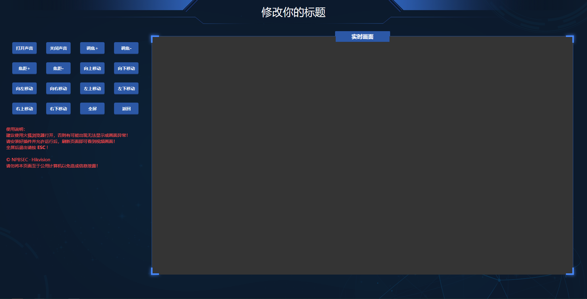

## 外观




## 使用方法

建议使用火狐等浏览器打开，请勿使用谷歌浏览器，否则打开会显示异常！

### 目录说明：

App : 火狐浏览器配置文件
Data : 火狐浏览器配置文件
WebSDKDemo : 海康威视 web 开发包（内含一个demo工程）
www : 开发好的 web 目录
FirefoxPortable.exe ： 火狐47浏览器主程序

### 使用说明：

你只需要修改 **jk-01** 文件夹下的 **config.js** 文件里的登录配置信息即可使用！

想要增加多个也只需要复制整个 **jk-01** 文件夹并重命名于你想要的名称，然后在外层首页 **html** 文件里添加一条指向你的文件夹的按钮代码即可！

```
<li><button class="t_btn" onclick="window.location='jk-01/index.html';">监控1 名称</button></li>
<li><button class="t_btn" onclick="window.location='jk-02/index.html';">监控1 名称</button></li>
······
```

特别需要说明的是，因为基于海康威视的 WEB SDK 开发，所以建议使用火狐浏览器，这里我已经将绿色版本免安装的火狐放置在这里了！

## 二次开发

请参照SDK和开发文档进行二次开发即可！